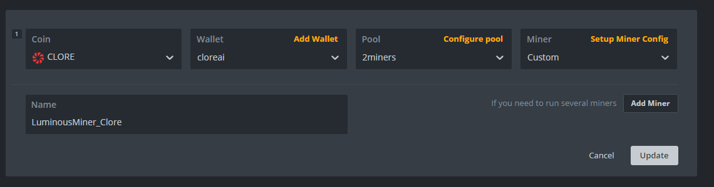
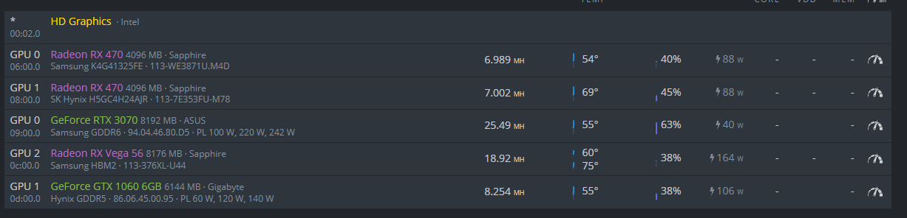

# HiveOS

## How use luminousminer on HiveOS ?

You must add luminousminer uses `custom miner` mode.  
  
Create new `Flight Sheet`.  

Click on `Setup Miner Config`.  
Add link of release `lumininosminer-X.X_hiveos.tar.gz` in field `URL`.  
Replace `YOUR_WALLET` by your wallet.  
Replace `YOUR_WORKERNAME` by your workername.  

  
Save and run your flight sheet.  
Enjoy the miner is running!  

  
